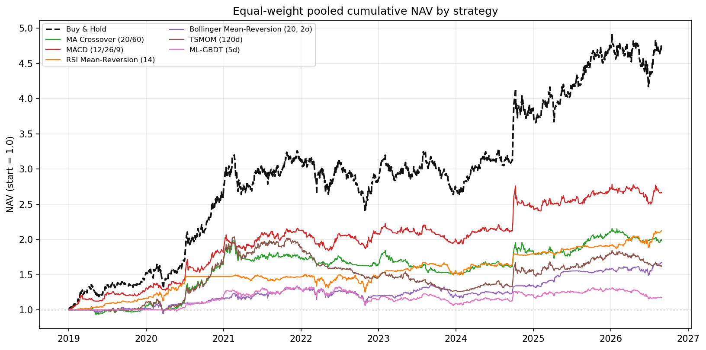
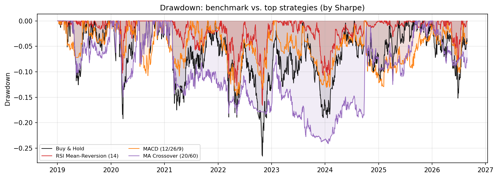
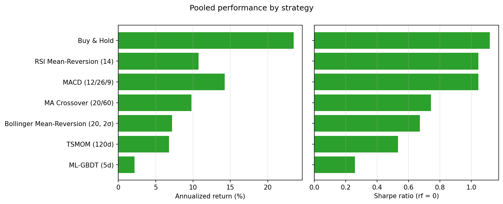
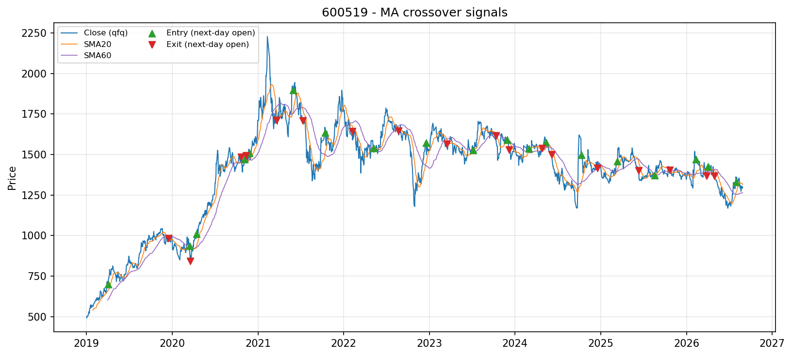
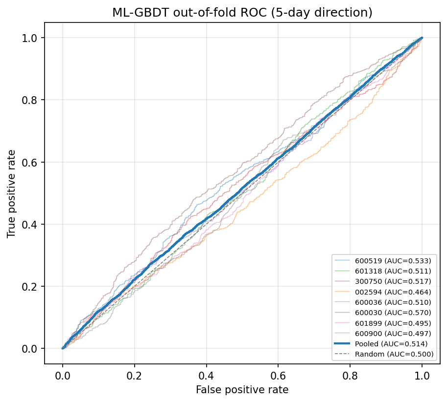
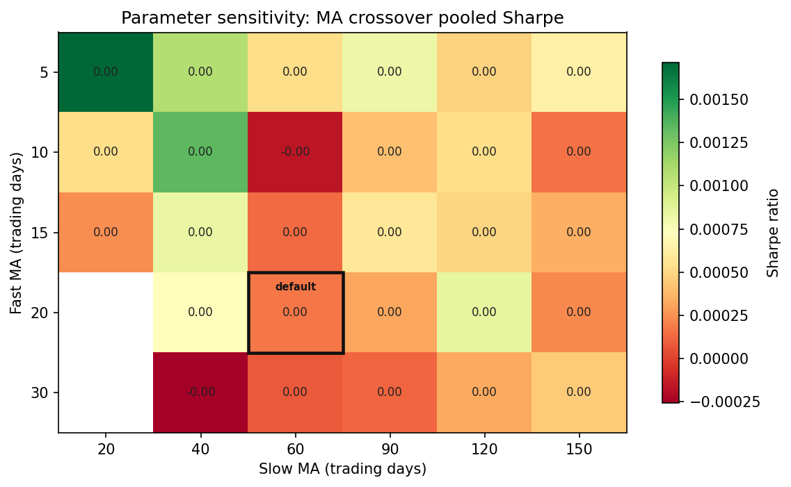

<div align="center">

# TrendQuant 📈

**基于多源数据的股票趋势量化分析与策略评估框架**

*A reproducible, statistics-first framework for stock trend analysis and strategy evaluation on Chinese A-shares.*

[](https://github.com/Zhuayu16/trendquant/actions/workflows/ci.yml)


</div>

---

## 📌 项目定位

这不是一个「炒股软件」，而是一个**结论可检验、结果可复现**的量化研究管线：
在严格无前视偏差的统一回测协议下，比较技术规则、统计动量与机器学习三类策略
相对买入持有基准的样本外表现，并用假设检验回答一个问题——

> **「看走势做判断」的技术信号，扣除真实成本后到底有没有统计上可辨认的预测力？**

设计对齐实证金融的研究规范：信号 t 日收盘生成、t+1 开盘成交、双边计入
佣金/印花税/滑点、ML 使用 gap 等于标签前瞻期的 walk-forward 协议。
负结果同样完整报告（本样本上，没有策略在收益口径显著跑赢买入持有——
见下方[核心发现](#-核心发现)与[实验报告](docs/experiment_report.md)）。

## ✨ 核心特性

- **多数据源**：AkShare（A股前复权）/ yfinance（备用与全球市场）/ 确定性合成数据（测试与离线演示），本地 CSV 缓存与重试
- **纯向量化指标库**：SMA/EMA/MACD/RSI(Wilder)/BOLL/ATR/KDJ，零 TA-Lib 依赖，窗口未满显式返回 NaN
- **三类策略同台**：技术规则（双均线、MACD、RSI、布林带）· 统计动量（TSMOM）· 梯度提升方向预测
- **无前视回测引擎**：t 收盘出信号 → t+1 开盘成交；建仓/持有/平仓日收益分别精确建模
- **ML 防泄漏**：15 个特征只用 t 日及以前信息；`TimeSeriesSplit(gap=horizon)` 保证标签窗口与测试期不重叠；仅用样本外概率生成信号
- **统计推断内建**：单样本 t / 配对 t / 二项 / ADF 平稳性检验，报告自动标注显著性
- **一键产出**：Markdown 实验报告 + 6 张出版级图表 + 4 个 CSV，全部由代码生成
- **工程质量**：42 个单元/集成测试、Ruff 静态检查、GitHub Actions 多版本 CI、pyproject 现代打包

## 📊 核心发现

> 8 只 A 股等权组合 · 2019-01-02 ~ 2026-08-28（1856 个交易日）· 含双边交易成本

1. **收益口径**：5% 显著性水平下，**没有任何主动策略显著优于买入持有**——与弱式有效市场假说（Fama 1970）在本样本的表现一致；
2. **风险口径**：MACD 以基准**一半的最大回撤**（-14.66% vs -26.56%）取得与基准统计上无显著差异的收益（配对 t 检验 p=0.057），Calmar 0.97 反超基准的 0.88，是风险调整口径下的可行替代；
3. **ML 的启示**：方向命中率 50.83%（12360 个样本外预测，二项检验 p=0.034，显著高于抛硬币）却依然显著跑输基准——**预测精度 ≠ 策略盈利能力**，交易成本与保守触发阈值吃掉了全部统计优势。

## 📈 完整实验结果

### 实验设置

| 项目 | 配置 |
|---|---|
| 数据源 | yfinance A 股前复权日线（AkShare 东财源可一键切换） |
| 股票池 | 贵州茅台、中国平安、宁德时代、比亚迪、招商银行、中信证券、紫金矿业、长江电力（8 只，等权合并） |
| 策略 | 买入持有 · 双均线(20/60) · MACD(12/26/9) · RSI 均值回归(14) · 布林带(20,2σ) · TSMOM(120日) · ML-GBDT(5日) |
| 执行假设 | t 日收盘出信号，t+1 开盘成交；仅做多、0/1 仓位 |
| 成本模型 | 佣金 0.025%（双边）+ 印花税 0.05%（卖出）+ 滑点 0.10%（双边） |
| ML 设定 | HistGradientBoosting · 标签=未来 5 日方向 · walk-forward 5 折（gap=5）· 建仓阈值 p>0.55 |

### 组合层绩效（各标的等权合并，1856 个交易日）

| 策略 | 累计收益 | 年化收益 | 年化波动 | 夏普 | 索提诺 | 最大回撤 | 卡玛 | 日胜率 | 建仓次数 | p(μ=0) | p(vs基准) |
|---|---:|---:|---:|---:|---:|---:|---:|---:|---:|---:|---:|
| 买入持有（基准） | 372.28% | **23.46%** | 20.79% | **1.118** | 1.723 | -26.56% | 0.884 | 52.32% | 8 | 0.0024 | — |
| MACD (12/26/9) | 166.57% | 14.24% | 13.63% | 1.045 | 1.607 | **-14.66%** | **0.971** | 48.60% | 556 | 0.005 | 0.057 |
| RSI 均值回归 (14) | 112.34% | 10.76% | **10.28%** | 1.046 | 1.487 | -16.59% | 0.649 | 44.61% | 58 | 0.005 | 0.026 ⁻ |
| 双均线交叉 (20/60) | 99.07% | 9.80% | 13.89% | 0.743 | 1.045 | -24.13% | 0.406 | 47.74% | 153 | 0.044 | 0.003 ⁻ |
| 布林带均值回归 | 67.06% | 7.22% | 11.30% | 0.673 | 0.882 | -19.98% | 0.361 | 45.04% | 155 | 0.068 | 0.004 ⁻ |
| 时序动量 (120d) | 62.11% | 6.78% | 14.19% | 0.533 | 0.740 | -38.29% | 0.177 | 46.88% | 335 | 0.148 | 0.0004 ⁻ |
| ML-GBDT (5日) | 17.38% | 2.20% | 10.57% | 0.259 | 0.368 | -20.98% | 0.105 | 39.55% | 1252 | 0.483 | 0.0001 ⁻ |

> 表中旧版普通 t 检验数字用于复现实验快照；当前代码同时输出 Newey-West HAC 稳健 p 值和 Holm 多重比较校正值，自动报告的结论以稳健校正口径为准。
> 完整逐标的 × 逐策略指标见 [`docs/experiment_report.md`](docs/experiment_report.md) 与运行产物 `stats_by_symbol.csv`。

### 图表

> 说明：本项目当前采用命令行运行，没有独立桌面 GUI。以下截图来自一次 `--demo` 运行生成的报告与结果图，可作为运行结果界面预览。

| 组合累计净值 | 回撤对比（基准 vs 夏普前三） |
|---|---|
|  |  |

| 年化收益与夏普 | 买卖点示例（600519 × 双均线） |
|---|---|
|  |  |





### 机器学习样本外表现（walk-forward，12360 个样本外预测）

汇总方向命中 **6282/12360（50.83%）**，二项检验（H0: 命中率=50%）p = **0.034**——
预测力存在但微弱，不足以覆盖成本。

| 标的 | 方向命中率 | 样本外样本 | ROC AUC |
|---|---:|---:|---:|
| 600519 贵州茅台 | 52.88% | 1545 | 0.533 |
| 601318 中国平安 | 51.72% | 1545 | 0.511 |
| 300750 宁德时代 | 52.04% | 1545 | 0.517 |
| 002594 比亚迪 | 47.06% | 1545 | 0.464 |
| 600036 招商银行 | 50.23% | 1545 | 0.510 |
| 600030 中信证券 | 54.17% | 1545 | 0.570 |
| 601899 紫金矿业 | 50.03% | 1545 | 0.494 |
| 600900 长江电力 | 48.48% | 1545 | 0.497 |

### 分标的夏普矩阵（策略 × 个股）

| 标的 | MACD | ML-GBDT | RSI 均值回归 | 买入持有 | 双均线 | 布林带 | TSMOM |
|---|---:|---:|---:|---:|---:|---:|---:|
| 002594 比亚迪 | 0.77 | -0.42 | 0.84 | 0.78 | 0.74 | 0.28 | 0.50 |
| 300750 宁德时代 | 0.75 | 0.46 | 0.71 | 0.93 | 0.79 | -0.13 | 0.68 |
| 600030 中信证券 | 0.91 | 0.67 | 0.70 | 0.49 | -0.16 | 0.49 | -0.07 |
| 600036 招商银行 | 0.58 | -0.50 | 0.27 | 0.54 | 0.15 | 0.48 | 0.15 |
| 600519 贵州茅台 | 0.06 | 0.30 | 0.61 | 0.60 | 0.41 | 0.49 | -0.60 |
| 600900 长江电力 | 0.25 | -0.51 | 0.39 | 0.77 | 0.25 | 0.78 | 0.38 |
| 601318 中国平安 | 0.36 | -0.14 | 0.03 | 0.30 | -0.16 | 0.03 | 0.08 |
| 601899 紫金矿业 | 0.68 | 0.60 | 0.95 | 1.08 | 0.67 | 1.00 | 0.61 |

> 读法：没有任何策略在全部 8 只个股上一致占优；MACD 在券商（600030）上优势最大
> （0.91 vs 基准 0.49），均值回归族在券商/强周期股上整体好于在白酒/公用事业上——
> 策略有效性存在明显的标的依赖，这正是需要统计检验而非肉眼结论的原因。

### 数据平稳性（ADF 单位根检验）

| 序列 | 结论 |
|---|---|
| 对数价格 | 8 只中仅 3 只在 5% 水平拒绝单位根（茅台 0.001 / 招行 0.048 / 中信 0.046），整体不可拒绝 → **价格非平稳** |
| 日收益率 | 8 只全部 p≈0.000 → **1% 水平下平稳**，支持以收益率/价格比值为特征建模 |

## ⏱ 性能基准

| 项目 | 耗时 | 环境 |
|---|---:|---|
| 完整实验（8 标的 × 7 策略，含 ML，热缓存） | **10.2 s** | Windows 11 · Python 3.13.5 |
| 首次运行（含 8 只标的真实数据下载） | ~30 s | 同上 |
| 演示模式 `--demo`（合成数据，无需联网） | ~8 s | 同上 |
| 全部 42 个单元/集成测试 | **约 10 s** | 同上 |
| Ruff 静态检查 | <1 s | ruff 0.14 |

结果可复现：`python -m trendquant --source yfinance --start 2019-01-01`。
ML 使用 OpenMP 并行，命中数在个位样本内存在运行间浮动（`random_state` 已固定）；
回测与指标计算完全确定性。

## 🚀 快速开始

```bash
git clone https://github.com/YOUR_USERNAME/trendquant.git
cd trendquant

# Python ≥ 3.10；推荐 conda 环境
pip install -r requirements.txt        # 含 akshare、pytest、ruff
python -m pytest tests -q              # 42 个测试

# 无网络演示（合成数据，10 秒出全套报告）
python -m trendquant --demo

# A 股真实数据完整实验（内置 8 只标的，首次运行自动缓存）
python -m trendquant --source akshare --start 2019-01-01

# 自定义股票池 / 跳过 ML / 美股代码
python -m trendquant --symbols 600519,300750 --start 2021-01-01
python -m trendquant --skip-ml
python -m trendquant --symbols AAPL,MSFT --source yfinance
```

输出（`outputs/`，已 gitignore）：

```
outputs/
├── report.md               # 自动生成的实验报告（与 docs/experiment_report.md 同构）
├── stats_pooled.csv        # 组合层绩效 + 检验
├── stats_by_symbol.csv     # 分标的 × 分策略明细
├── adf_tests.csv           # 平稳性检验
└── figures/                # 净值、回撤、条形图、买卖点、ROC、参数热力图
```

## 🔬 方法论

```
┌─────────┐   ┌──────────────┐   ┌─────────────────────┐   ┌──────────────────────┐
│ 数据层   │ → │  指标与特征   │ → │      策略层          │ → │      回测层           │
│ AkShare │   │ 15 个 ML 特征 │   │ 技术规则 × 4         │   │ t 收盘出信号          │
│ yfinance│   │ SMA/EMA/MACD │   │ TSMOM 动量 × 1       │   │ t+1 开盘成交          │
│ 合成数据 │   │ RSI/BOLL/ATR │   │ ML-GBDT walk-forward │   │ 佣金+印花税+滑点      │
└─────────┘   └──────────────┘   └─────────────────────┘   └──────────┬───────────┘
                                                                      ↓
                    ┌───────────────────────────┐   ┌──────────────────────────────┐
                    │        报告层             │ ← │        统计检验层             │
                    │ Markdown 报告 + 6 张图表   │   │ HAC / Holm / 二项 / ADF        │
                    └───────────────────────────┘   └──────────────────────────────┘
```

学术设计的完整推导（含全部公式、执行协议、检验的原假设与**诚实的局限清单**）
见 **[docs/methodology.md](docs/methodology.md)**；
实跑产出的完整报告见 **[docs/experiment_report.md](docs/experiment_report.md)**。

关键防错设计一览：

- ✅ 信号 t 收盘生成，t+1 开盘成交（`tests/test_backtest.py` 逐情形验证）
- ✅ ML 特征历史截断一致性测试（`test_ml_features_no_lookahead`）
- ✅ `gap=horizon` 杜绝标签窗口与测试期重叠
- ✅ 印花税仅计入卖出，滑点双边计提
- ✅ 报告与图表 100% 由当次运行生成，数字与代码输出严格一致

## 📁 项目结构

```
trendquant/
├── trendquant/                 # 主包
│   ├── data/loader.py          #   AkShare / yfinance / 合成数据 + 缓存
│   ├── indicators.py           #   技术指标（纯 pandas 向量化）
│   ├── features.py             #   ML 特征工程与标签
│   ├── models/
│   │   ├── rules.py            #   技术规则策略
│   │   ├── statistical.py      #   时序动量
│   │   └── ml.py               #   梯度提升 + walk-forward
│   ├── backtest/
│   │   ├── engine.py           #   无前视回测引擎
│   │   └── metrics.py          #   绩效指标 + 统计检验
│   ├── evaluation.py           #   实验编排（多标的 × 多策略）
│   ├── plotting.py             #   图表（英文标注，跨平台渲染一致）
│   ├── reporting.py            #   Markdown 报告生成
│   ├── universe.py             #   默认 A 股股票池
│   └── cli.py                  #   python -m trendquant 入口
├── docs/
│   ├── methodology.md          #   学术方法论（公式 + 检验 + 局限）
│   ├── experiment_report.md    #   示例实验报告（真实数据跑出的结果）
│   └── figures/                #   示例图表
├── tests/                      #   42 个单元/集成测试
├── .github/workflows/ci.yml    #   CI（Python 3.10 & 3.13 × lint + pytest）
└── pyproject.toml              #   打包 / Ruff / Pytest 配置
```

## 🗺️ Roadmap

- [x] Newey-West HAC + Holm 多重比较校正
- [ ] Block bootstrap 稳健推断
- [ ] 涨跌停、T+1、停牌的成交约束建模
- [ ] 横截面 pooled ML（多标的共享模型）与简单组合优化
- [ ] 参数平面稳健性热力图（对抗数据窥探）
- [ ] 基于样本期初成分股的 Universe（消除幸存者偏差）

## ⚠️ 免责声明

本项目**仅用于量化研究方法论的演示与教学**。历史回测收益不代表未来表现，
所有输出不构成任何投资建议。市场有风险，投资需谨慎。

## 🔖 引用

如果你在研究中使用了本项目，欢迎引用（上传后 GitHub 会出现 "Cite this repository" 按钮）：

```bibtex
@software{TrendQuant,
  title  = {TrendQuant: 基于多源数据的股票趋势量化分析与策略评估框架},
  author = {Your Name},
  year   = {2026},
  url    = {https://github.com/YOUR_USERNAME/trendquant},
  note   = {Multi-source stock trend analysis and strategy evaluation}
}
```

## 📚 参考文献

精选（完整列表见 [docs/methodology.md](docs/methodology.md)）：

- Fama, E. F. (1970). Efficient capital markets: A review of theory and empirical work. *Journal of Finance*, 25(2).
- Brock, W., Lakonishok, J., & LeBaron, B. (1992). Simple technical trading rules and the stochastic properties of stock returns. *Journal of Finance*, 47(5).
- Moskowitz, T., Ooi, Y. H., & Pedersen, L. H. (2012). Time series momentum. *Journal of Financial Economics*, 104(2).
- Gu, S., Kelly, B., & Xiu, D. (2020). Empirical asset pricing via machine learning. *Review of Financial Studies*, 33(5).

---

<div align="center">

**MIT License** · 用统计说话，对结果诚实。

</div>
